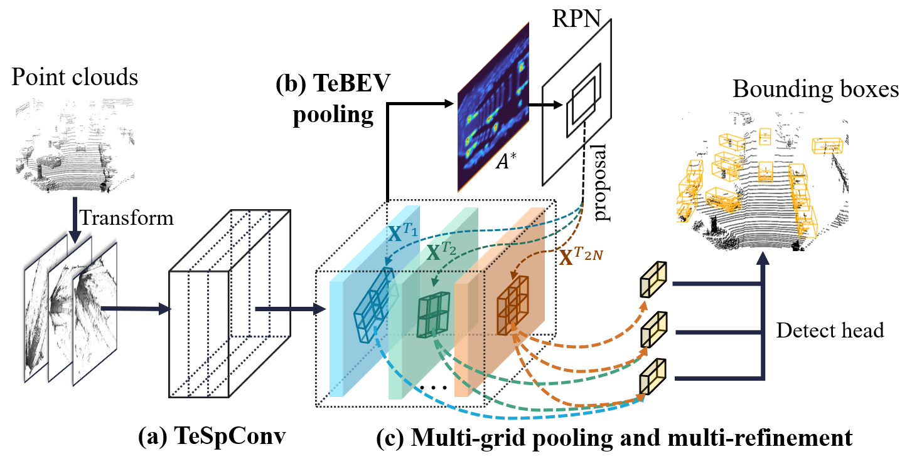

# TED
This is a improved version of [TED](https://arxiv.org/) (Learning Transformation-Equivariant Features for 3D Object Detection) by a multiple refinement design. 
This code is mainly based on [OpenPCDet](https://github.com/open-mmlab/OpenPCDet), some codes are from 
[PENet](https://github.com/JUGGHM/PENet_ICRA2021) and [SFD](https://github.com/LittlePey/SFD).

## Detection Framework
The overall detection framework is shown below.
(1) Transformation-equivariant Sparse Convolution (TeSpConv) backbone; (2) Transformation-equivariant Bird Eye View (TeBEV) pooling; 
(3) Multi-grid pooling and multi-refinement. 
TeSpConv applies shared weights on multiple transformed point clouds to record the transformation-equivariant voxel features. 
TeBEV pooling aligns and aggregates the scene-level equivariant features into lightweight representations for proposal generation.
 Multi-grid pooling and multi-refinement align and aggregate the instance-level invariant features for proposal refinement.
 


## Model Zoo
We release two models, which are based on LiDAR-only and multi-modal data respectively. We denoted the two models as TED-S and TED-M respectively.

* All models are trained with 8 V100 GPUs and are available for download. 

* The models are trained with train split (3712 samples) of KITTI dataset

* The results are the 3D AP(R40) of Car on the *val* set of KITTI dataset.

|                                             |Modality|GPU memory of training| Easy | Mod. | Hard  | download | 
|---------------------------------------------|----------:|----------:|:-------:|:-------:|:-------:|:---------:|
| [TED-S](tools/cfgs/models/kitti/TED-S.yaml)|LiDAR only|~12 GB |93.24| 87.96| 86.27| [model-36M](https://drive.google.com/file/d/1hqoj-lV4Cr3m7U3EphdCSjHmhBlekRm8/view?usp=sharing) | 
| [TED-M](tools/cfgs/models/kitti/TED-M.yaml)|LiDAR+RGB |~15 GB| 95.62 |89.24 |86.77 | [model-65M](https://drive.google.com/file/d/1hXe1at-LKogTfWorALmq6djjYqhKX7nD/view?usp=sharing) |

## Getting Started
### Dependency
Our released implementation is tested on.
+ Ubuntu 18.04
+ Python 3.6.9 
+ PyTorch 1.8.1
+ Spconv 1.2.1
+ NVIDIA CUDA 11.1
+ 8x Tesla V100 GPUs

We also tested on.
+ Ubuntu 18.04
+ Python 3.6.9 
+ PyTorch 1.8.1
+ Spconv 2.1.21
+ NVIDIA CUDA 11.1
+ 2x 3090 GPUs

### Prepare dataset

You need creat a 'velodyne_depth' dataset to run our multimodal detector:
You can download our preprocessed data [here (13GB)](https://drive.google.com/file/d/1xki9v_zsQMM8vMVNo0ENi1Mh_GNMjHUg/view?usp=sharing), or generate the data by yourself:

* Download the PENet depth completion model [here (500M)](https://drive.google.com/file/d/1RDdKlKJcas-G5OA49x8OoqcUDiYYZgeM/view?usp=sharing) and put it into ```tools/PENet```.
* Then run the following code to generate RGB pseudo points.
```
cd tools/PENet
python3 main.py --detpath [your path like: ../../data/kitti/training]
```

* After that, run following command to creat dataset infos:
```
python3 -m pcdet.datasets.kitti.kitti_dataset create_kitti_infos tools/cfgs/dataset_configs/kitti_dataset.yaml
python3 -m pcdet.datasets.kitti.kitti_dataset_mm create_kitti_infos tools/cfgs/dataset_configs/kitti_dataset.yaml
```

Anyway, the data structure should be: 
```
TED
├── data
│   ├── kitti
│   │   │── ImageSets
│   │   │── training
│   │   │   ├──calib & velodyne & label_2 & image_2 & (optional: planes) & velodyne_depth
│   │   │── testing
│   │   │   ├──calib & velodyne & image_2 & velodyne_depth
│   │   │── gt_database
│   │   │── gt_database_mm
│   │   │── kitti_dbinfos_train_mm.pkl
│   │   │── kitti_dbinfos_train.pkl
│   │   │── kitti_infos_test.pkl
│   │   │── kitti_infos_train.pkl
│   │   │── kitti_infos_trainval.pkl
│   │   │── kitti_infos_val.pkl
├── pcdet
├── tools
```

### Setup

```
cd TED
python setup.py develop
```

### Training.

```
cd TED/tools
sh dist_train.sh
```

### Evaluation.

```
cd TED/tools
sh dist_test.sh
```

## License

This code is released under the [Apache 2.0 license](LICENSE).

## Acknowledgement
[OpenPCDet](https://github.com/open-mmlab/OpenPCDet)

[PENet](https://github.com/JUGGHM/PENet_ICRA2021)

[SFD](https://github.com/LittlePey/SFD)

## Citation
    @article{TED,
        title={Learning Transformation-Equivariant Features for 3D Object Detection},
        author={Hai, Wu and Chenglu, Wen and Wei, Li and Ruigang, Yang and Cheng, Wang},
        year={2022}
    }


